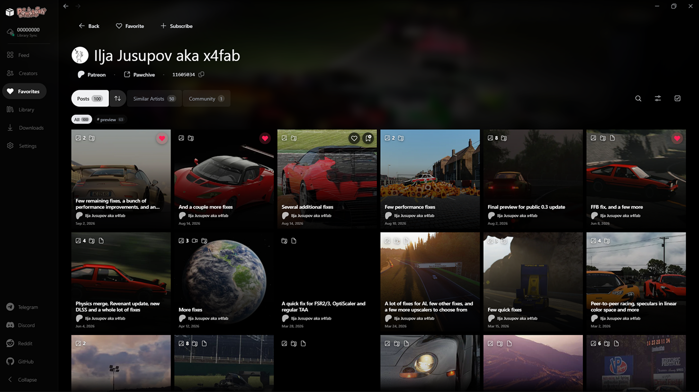
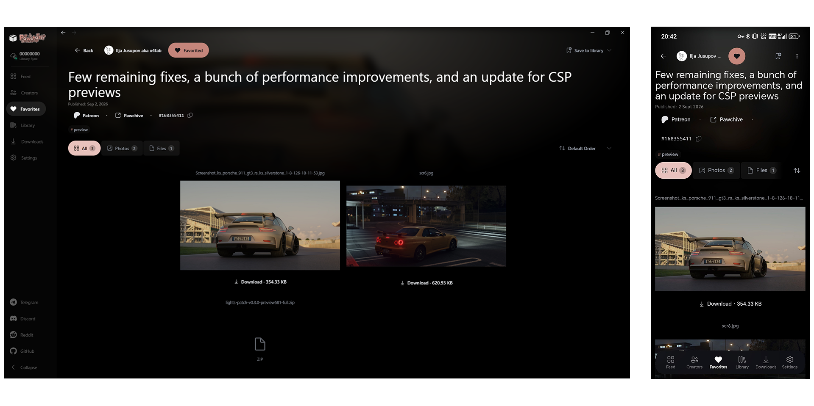
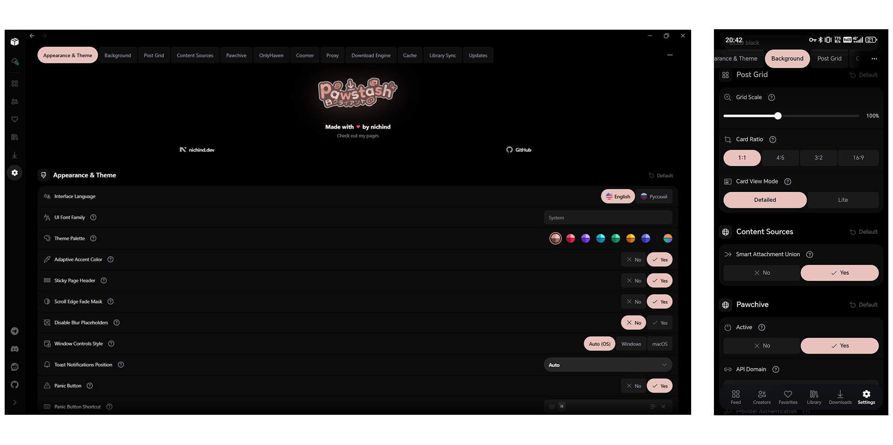

  

  A beautiful cross-platform client, downloader, and stash manager for pawchive, onlyhaven & coomer, with server sync and more sources in mind.

  
  
  
  
  
  
  

  <a href="#screenshots">Screenshots</a> • <a href="#downloads">Downloads</a> • <a href="#main-features">Main Features</a> • <a href="#feedback--issues">Feedback & Issues</a> • <a href="#license">License</a>

---

## Screenshots

### Creator Page

### Post Viewer

### Settings Page

---

## Main Features

- **Local-First & Offline**: Favorites, custom stashes, creator subscriptions, and saved media work 100% locally on your device.
- **Zero-Knowledge Sync**: End-to-end encrypted multi-device sync (XChaCha20-Poly1305 + Argon2id).
- **Downloads & Cache**: Download media attachments and cache viewed posts locally for offline access.
- **Cross-Platform**: Unified app for Windows, Android, macOS, and Linux.

---

## Downloads

| Platform | Package | Architecture | Direct Download |
| :--- | :--- | :--- | :--- |
| **Windows** | Standalone Portable | x64 |  |
| **Windows** | Setup Installer (`.exe`) | x64 |  |
| **Windows** | MSI Package (`.msi`) | x64 |  |
| **Android** | Signed APK (Recommended) | ARM64 (`arm64-v8a`) |  |
| **Android** | Universal APK | All Architectures |  |
| **Linux** | AppImage (`.AppImage`) | x64 |  |
| **Linux** | Debian (`.deb`) | x64 |  |
| **macOS** | Universal DMG (`.dmg`) | Apple Silicon / Intel |  |

---

## Feedback & Issues

Found a bug or have an idea to improve Pawstash?

---

## License

GNU General Public License v3.0 (GPL-3.0) — see [LICENSE](LICENSE) for details.

